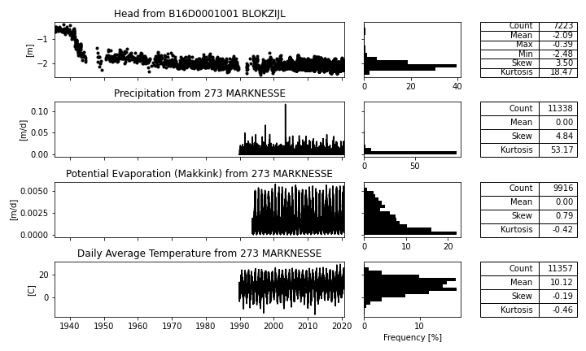
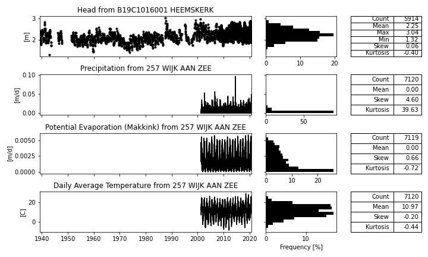
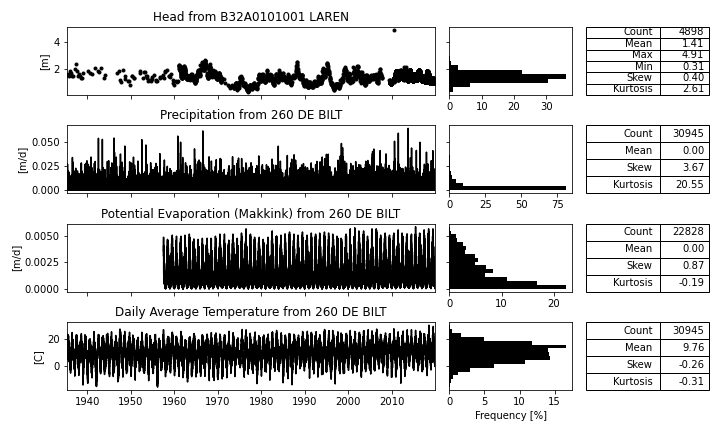
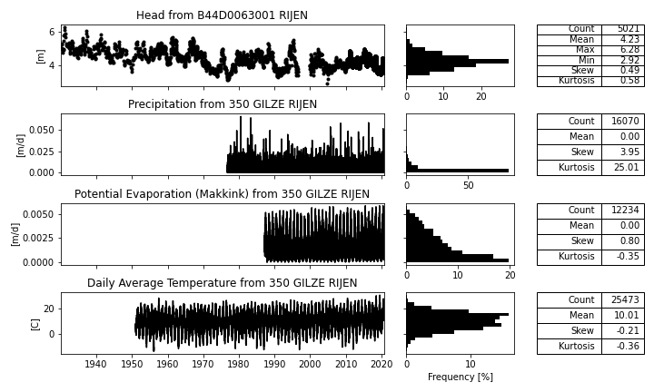
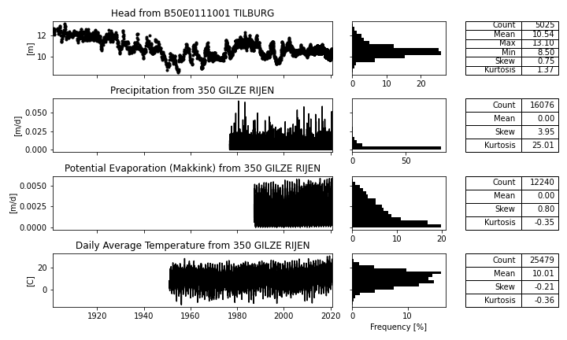
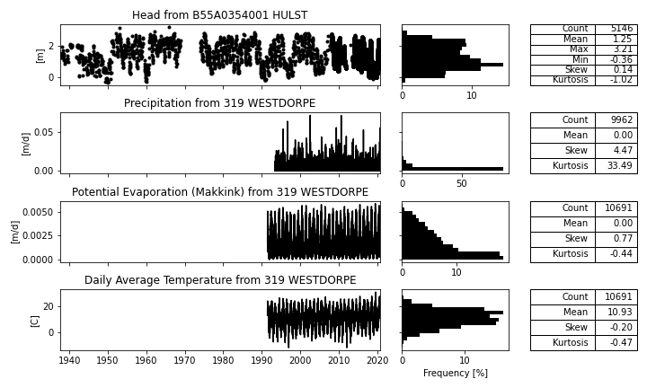

# Data for the six longest head obsveration wells in the Netherlands

This dataset contains the data used in (Dutch) Stromingen article [Lessen uit lange grondwaterreeksen (Lessons from Long Groundwater Time Series)](https://www.nhv.nu/stroming/nieuws/stromingen_202102_artikel_verhagen/) - Floris Verhagen and Lisette Avis (2021). The head measurements are obtained from [DINOloket](https://www.dinoloket.nl/) and the meteorological data obtained from the [KNMI](https://www.knmi.nl/nederland-nu/klimatologie-metingen-en-waarnemingen). 

The datasets have been read using the pastas functions read_knmi and read_dino using the associated fill options for nans. One outlier has been removed for B32A0101001 at 2010-06-07.

Visualizations are available for the full duration of the six head time series. 

## B16D0001001 Blokzijl

## B19C1016001 Heemskerk

## B32A0101001 Laren

## B44D0063001 Rijen

## B50E0111001 Tilburg

## B55A0354001 Hulst
