# Data From van der Spek and Bakker (2017)

This dataset contains the data used in [The influence of the length of the calibration period and observation frequency on predictive uncertainty in time series modeling of groundwater dynamics](https://agupubs.onlinelibrary.wiley.com/share/XCUXCQGWFNHFZMKRFTVU?target=10.1002/2016WR019704) - Joanne van der Spek and Mark Bakker (2017). The head measurements are obtained from [DINOloket](https://www.dinoloket.nl/) and the meteorological data obtained from the [KNMI](https://www.knmi.nl/nederland-nu/klimatologie-metingen-en-waarnemingen). The supporting information [Table S1](https://agupubs.onlinelibrary.wiley.com/action/downloadSupplement?doi=10.1002%2F2016WR019704&file=wrcr22532-sup-0001-2016WR019704-s01.pdf) is followed to obtain the time series for the right measurement locations and filter depths. 

The datasets have been read using the pastas functions read_knmi and read_dino using the associated fill options for nans. For the precipitation time series the weather station time series are preferred to the rain station time series if available.

Visualizations are available for the full duration of the eighteen head time series. For a map of the head measurement locations we refer to [Figure 7](https://agupubs.onlinelibrary.wiley.com/cms/asset/7b77ff2a-3636-461c-8c93-1aaf1149bab6/wrcr22532-fig-0007-m.jpg) in van der Spek and Bakker (2017).

## B09B0124 De Koog
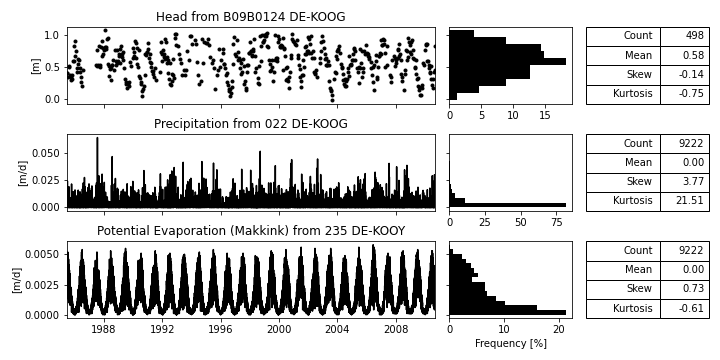

## B09D0360 Den Burg

## B11C0329 EAGMARYP
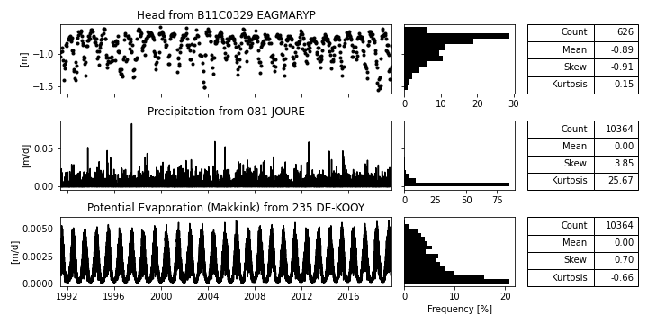

## B12B0001 NOORDLAREN
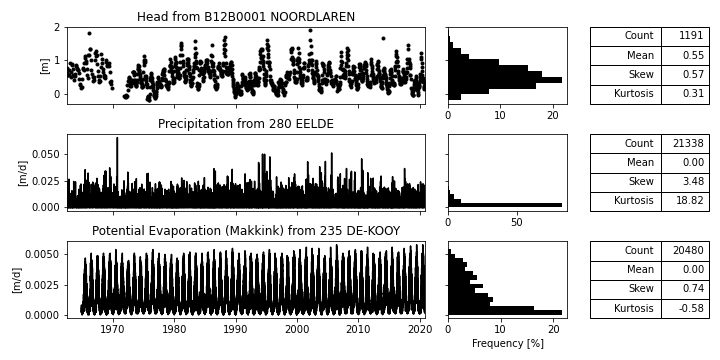

## B12G0075 NOOITGEDACHT
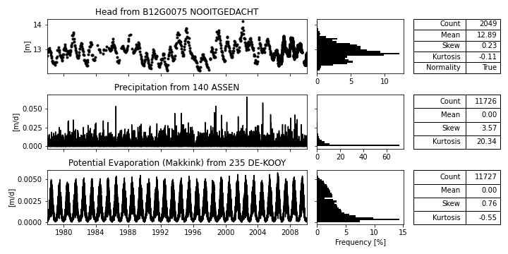

## B22C009 WITHAREN
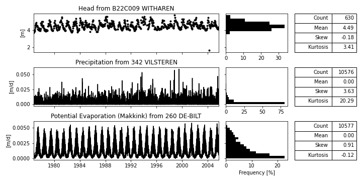

## B27H0042 AVERLO
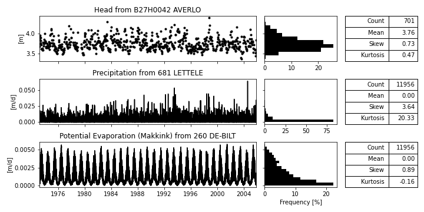

## B32C0572 DE BILT
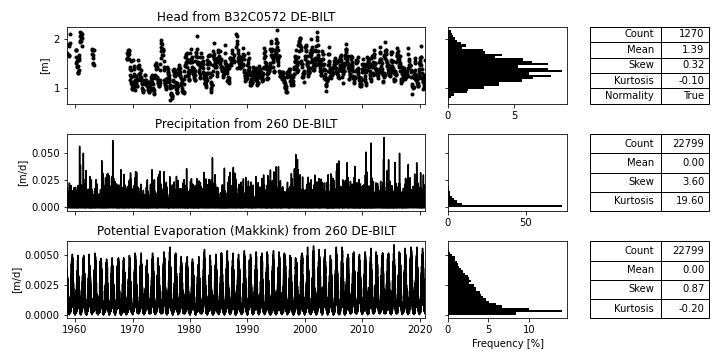

## B32E0031 PUTTEN
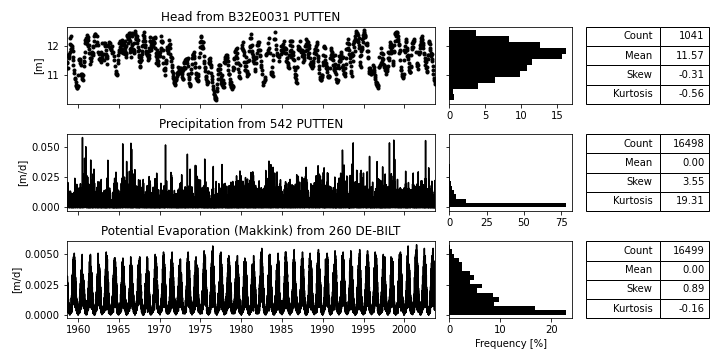

## B33B0505 UGHELEN
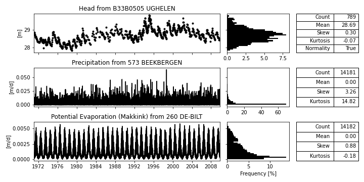

## B37E0646 DELFT
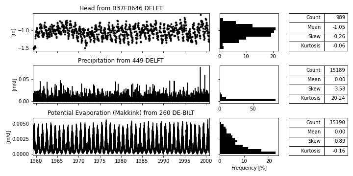

## B41A0171 DOETINCHEM
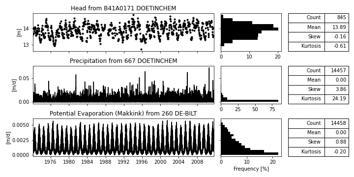

## B46C0191 STANTHONIS
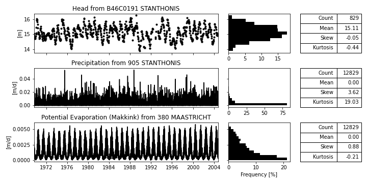

## B50H0026 GOIRLE
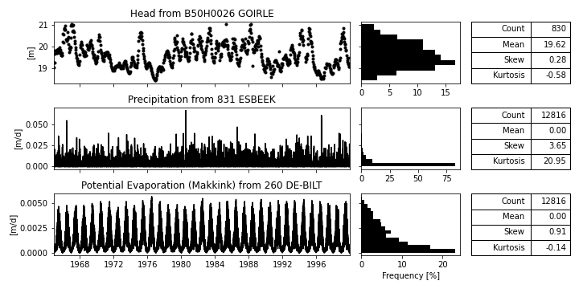

## B52B0390 OVERLOON
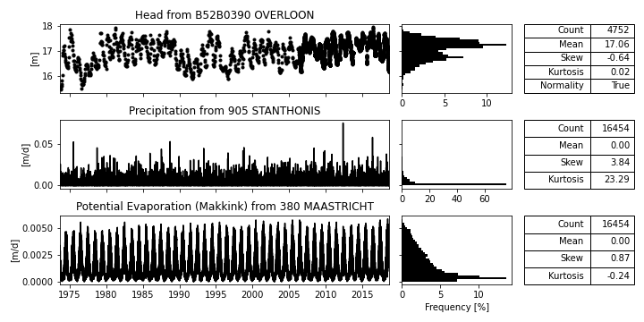

## B58C0698 WEERT

## B62A0133 GULPEN
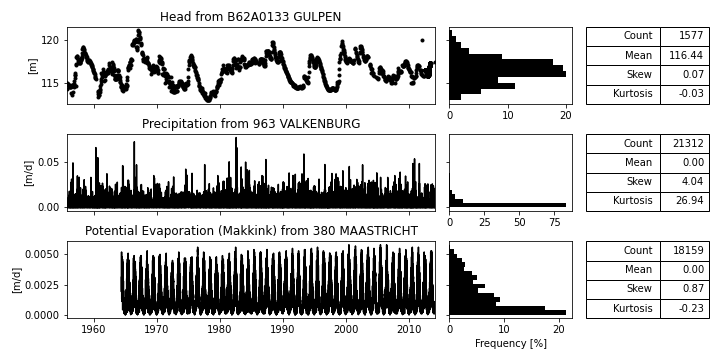

## B62B0748 WIJLRE
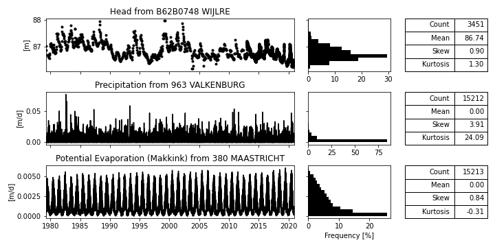